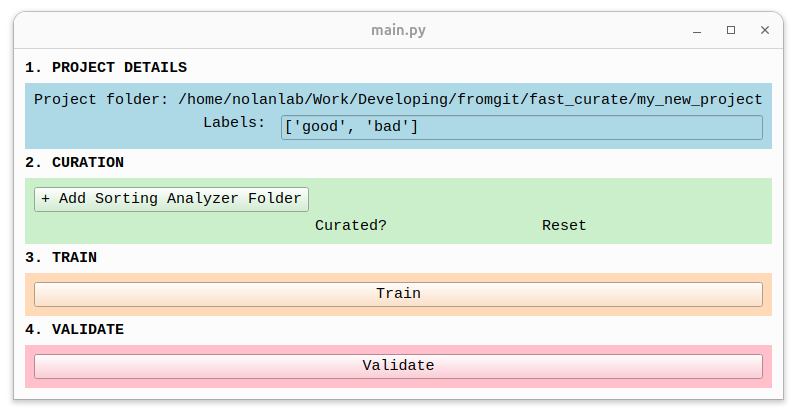
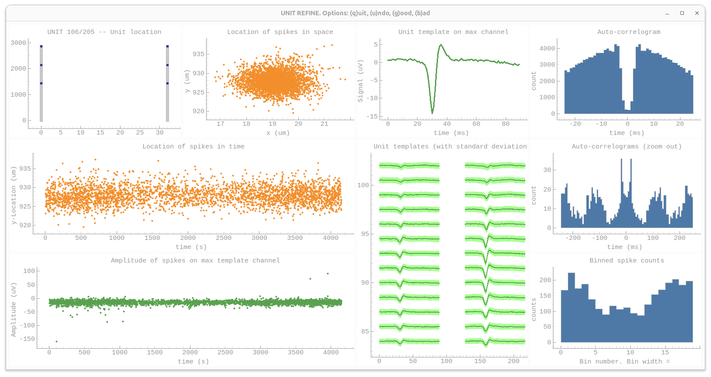

A spike curation tool, designed to be **fast** rather than flexible.

All good ideas inspired by [spikeinterface](https://github.com/SpikeInterface/spikeinterface) and [spikeinterface-gui](https://github.com/SpikeInterface/spikeinterface-gui). If you want a fully featured GUI which can do curation, merging, splitting and much much much more, check out spikeinterface-gui.

# Installation

Recommended steps:

1. Make a new virtual environment and activate it
More information: 
```
python -m venv ~/.venvs/fast_curate
source ~/.venvs/fast_curate
```

2. Clone this repository, move into the repo folder, and install:
```
git clone https://github.com/chrishalcrow/fast_curate.git
cd fast_curate
pip install .
```

# Run fast_curate

There are two ways to run the software. If you'd like to curate a bunch of sorting analyzers then train a model on your curation, you just need to run `main.py` and specify a project folder. Here's an example:

```
python src/fast_curate/main.py --project_folder my_new_project
```

A window should pop up that looks like this:



From here, it should be easy to change the labels, add sorting analyzers, curate the data and train a model. Keep an eye on the feedback that comes through the terminal - it will help!

If you'd just like to curate, you can run `curate.py` instead of `main.py`. For this you need to specify a few more things:

- A sorting analyzer folder
- The labels you're using
- Where to save the curation

Here's an example:

```
python src/fast_curate/curate.py --labels sua mua noise --analyzer_path /home/Work/my_experiment/derivatives/M25/D20/kilosort4_sa --output_folder /home/Work/my_experiment/derivatives/M25/D20/kilosort4_sa/curation
```

A window should pop up that looks like this:



This is heavily inspired by [spikeinterface](https://github.com/SpikeInterface/spikeinterface)'s report feature.